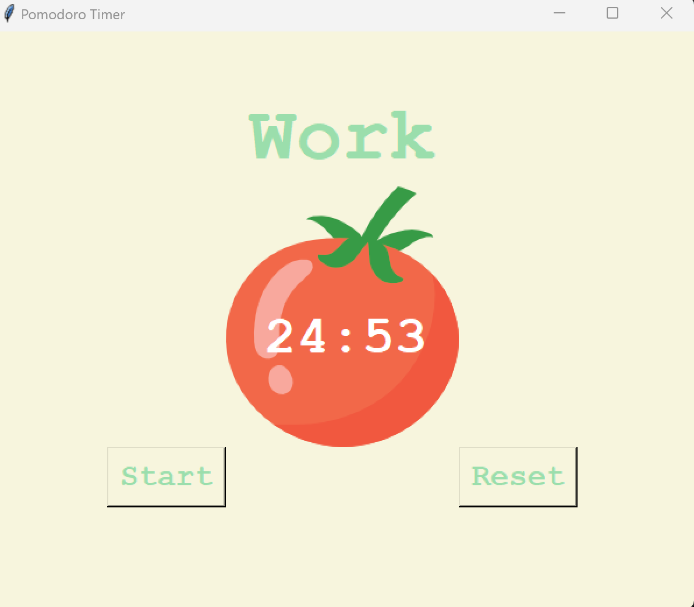

# Pomodoro Timer

## Description
Ce projet est une application de minuterie Pomodoro, développée en utilisant Python et Tkinter. La technique Pomodoro est une méthode de gestion du temps développée par Francesco Cirillo à la fin des années 1980. L'application permet à l'utilisateur de suivre des périodes de travail de 25 minutes, entrecoupées de courtes pauses de 5 minutes et de longues pauses de 20 minutes après chaque quatre périodes de travail.

## Fonctionnalités
- Démarrer une session de travail de 25 minutes.
- Faire une courte pause après chaque session de travail.
- Faire une longue pause après quatre sessions de travail.
- Réinitialiser le timer à tout moment.
- Affichage visuel du temps restant.

## Technologies Utilisées
- Python
- Tkinter

## Installation et Exécution
Pour exécuter cette application, vous aurez besoin de Python installé sur votre ordinateur. Suivez les étapes ci-dessous :

Clonez ce dépôt en utilisant 

## Captures d'écran

## Auteur
- Brydel Saounde

## Licence
Ce projet est sous licence MIT. Voir le fichier LICENSE pour plus de détails.

